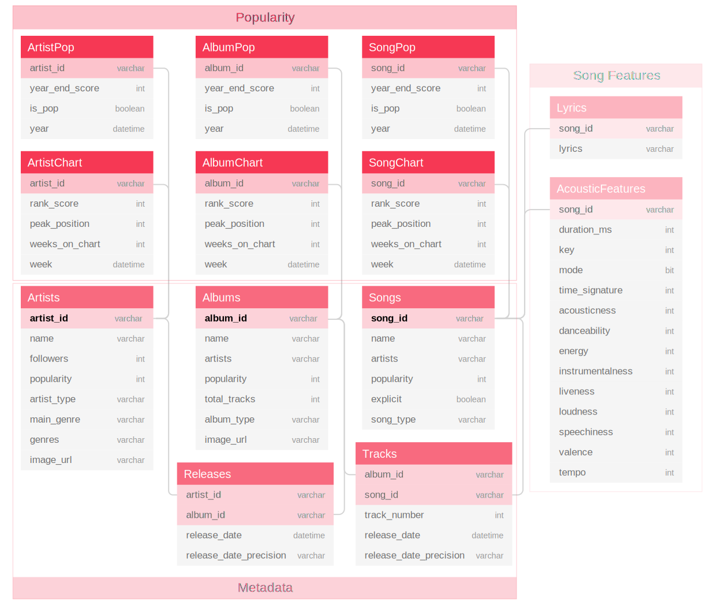

# DSW 2019 - DATASET SHOWCASE WORKSHOP 

[MusicOSet]: https://marianaossilva.github.io/DSW2019

> [MusicOSet][MusicOSet] - An Enhanced Music Dataset for Music Data Mining

## Dataset Information

This repository stores an open and enhanced dataset of musical elements (music, albums, and artists) suitable for music data mining. 

The attractive features of [MusicOSet][MusicOSet] include:
* Integration and centralization of different musical data sources
* Calculation of popularity scores and classification of hits and non-hits musical elements, varying from 1962 to 2018
* Enriched metadata for music, artists, and albums from the US popular music industry
* Availability of acoustic and lyrical resources
* Unrestricted access in two formats: SQL database and compressed .csv files

This is a **pre-publication release**. As such, this repository as well as the data are subject to change. 

## Dataset Statistics

---
**Data** | **# Records**
--- | ---
Songs | 20,772
Artists | 10,988
Albums | 25,378
Lyrics | 20,768
Acoustic Features | 20,728
Genres | 950
---

## Schema



## Format and Usage

[MusicOSet][MusicOSet] is available in a public repository in two different formats

1. **Relational Database** 
	- **[musicoset.sql]**:  SQL file that will create the relational database and subsequently loads all the information in the tables by a MySQL installation (343MB) 
2. **.csv Tables**
	- **[musicoset_metadata.zip]**: Contains textual and numeric information about songs, artists, and albums (7,05MB)
	- **[musicoset_popularity.zip]**: Contains nine tables of musical popularity information (14,1MB)
	- **[musicoset_songfeatures.zip]**: Contains lyrics and acoustic fingerprints of the songs collected (22,5MB)

[musicoset.sql]: https://github.com/marianaossilva/DSW2019/blob/master/docs/assets/data/musicoset.sql
[musicoset_metadata.zip]: https://github.com/marianaossilva/DSW2019/blob/master/docs/assets/data/musicoset_metadata.zip
[musicoset_popularity.zip]: https://github.com/marianaossilva/DSW2019/blob/master/docs/assets/data/musicoset_popularity.zip
[musicoset_songfeatures.zip]: https://github.com/marianaossilva/DSW2019/blob/master/docs/assets/data/musicoset_songfeatures.zip

## Applicability

* **Metadata Analysis**: [Collaboration profiles and their impact on musical success][SAC], ACM/SAC, Cyprus, 2019.
* **Hit Song Science**: [Causality analysis between collaboration profiles and musical success][WEB], Technical Report, Brazil, 2019.

[SAC]: https://dl.acm.org/citation.cfm?id=3297280.3297483
[WEB]: https://homepages.dcc.ufmg.br/~mirella/projs/bade/

<!-- ## Source (citation)

  ```
  @inproceedings{fma_dataset,
    title = {FMA: A Dataset for Music Analysis},
    author = {Defferrard, Micha\"el and Benzi, Kirell and Vandergheynst, Pierre and Bresson, Xavier},
    booktitle = {18th International Society for Music Information Retrieval Conference},
    year = {2017},
    url = {https://arxiv.org/abs/1612.01840},
  }
  ``` -->

## License

* The dataset is meant for research purposes.

## Acknowledgments

> The work is supported by [CNPq], Brazil.

[CNPq]: http://www.cnpq.br/